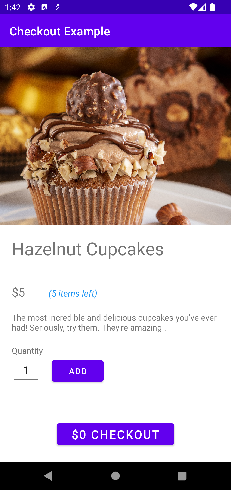
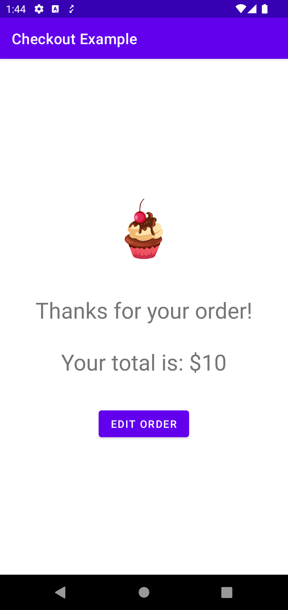
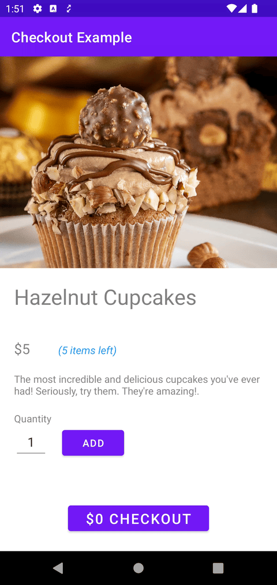

## Checkout Example for View Models tutorial
A simple app to show how to implement View Models on Android.

Watch the tutorial on YouTube here:
https://youtu.be/5d7U3DUxsDo

## Photo Credits
- Hazelnut cupcakes photo by [Jr R](https://unsplash.com/@wachalala?utm_source=unsplash&utm_medium=referral&utm_content=creditCopyText) on [Unsplash](https://unsplash.com/photos/90HdOlGbjck?utm_source=unsplash&utm_medium=referral&utm_content=creditCopyText)
- Cartoon Cupcake image by [ariosbeth](https://pngtree.com/freepng/cartoon-cupcake-for-birthday-decoration_5314854.html) on [PNGTree](https://pngtree.com/)

## Screenshots and Gifs
|||
| --- | --- |
||
